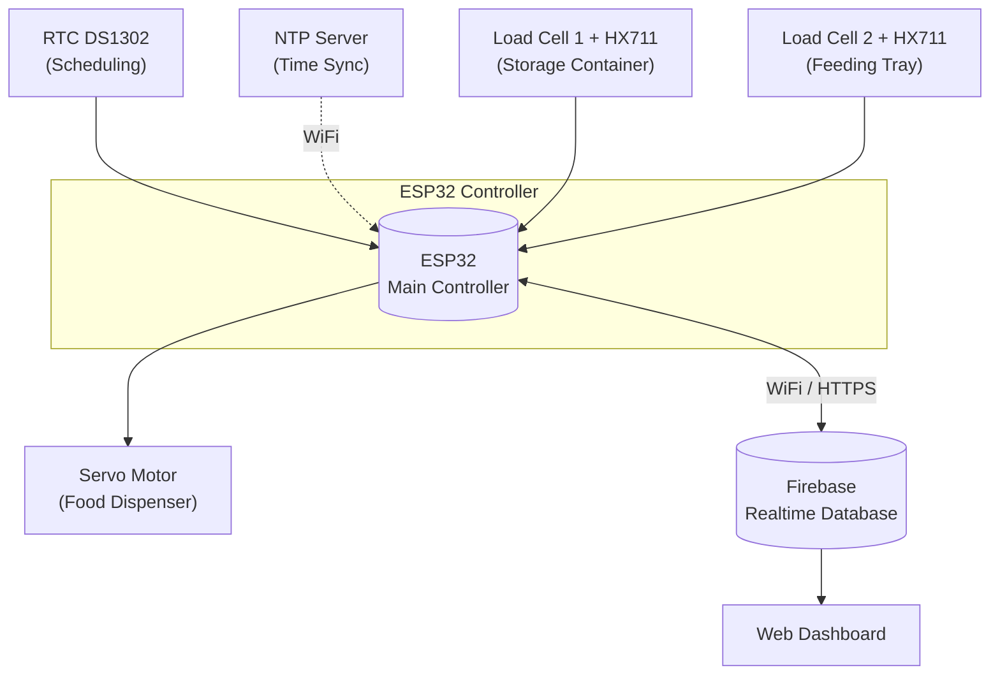
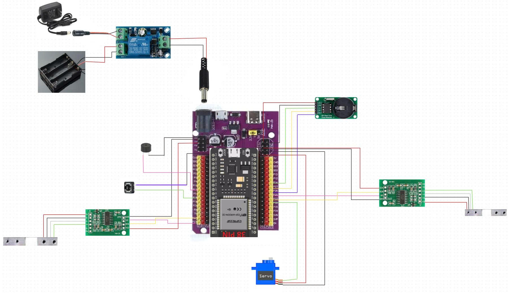
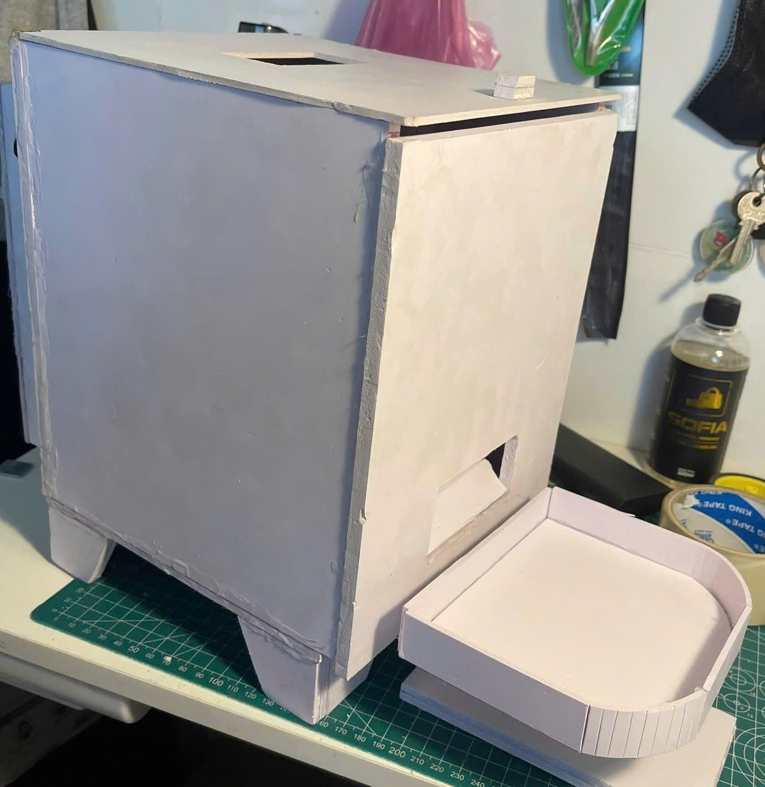
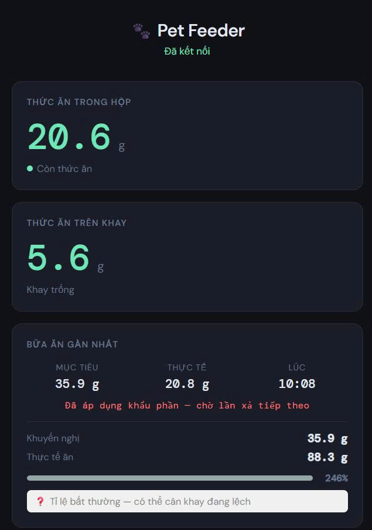
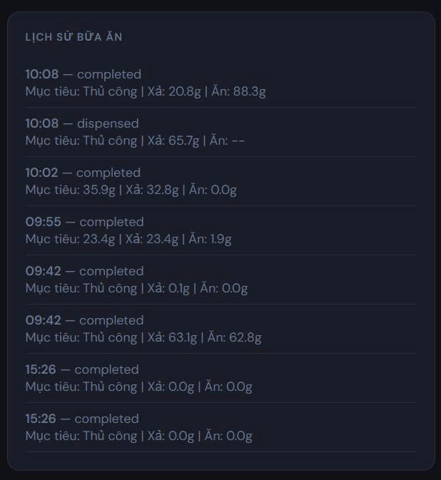
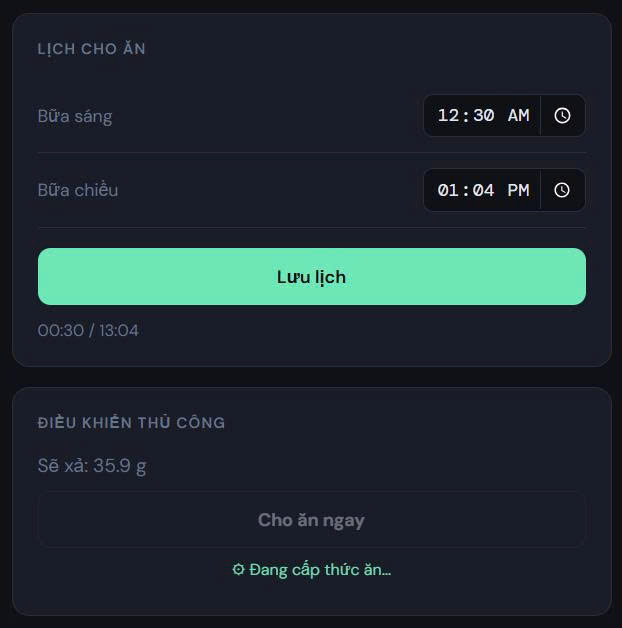
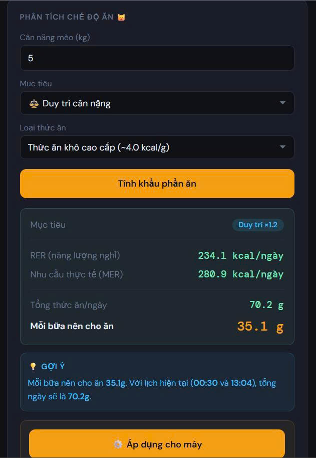
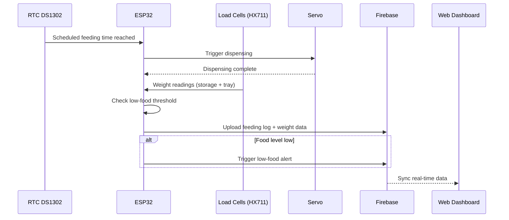

# Smart Pet Feeding System

[Tiếng Việt](./README.vi.md) | **English**

An IoT-based automatic pet feeding system built on **ESP32**, featuring scheduled feeding, real-time food level monitoring via dual load cells, and cloud-based tracking through **Firebase Realtime Database**, with a companion web dashboard.

---

## Overview

This project automates pet feeding using a microcontroller-based system that:
- Dispenses food on a fixed schedule (RTC + NTP synchronized)
- Monitors food quantity in both the **storage container** and the **feeding tray** using load cells
- Sends low-food alerts and logs feeding history to the cloud
- Allows remote monitoring through a web dashboard connected to Firebase

**Tech stack:** ESP32 · Firebase Realtime Database · Load Cell + HX711 · Servo Motor · RTC DS1302 · NTP

---

## System Block Diagram



**Components:**

| Component | Role |
|---|---|
| ESP32 | Central controller — reads sensors, controls servo, syncs with cloud |
| Load Cell + HX711 (x2) | Measures food weight in storage container and feeding tray |
| RTC DS1302 | Keeps real-time clock for scheduled feeding, backed up with NTP sync |
| Servo Motor | Opens/closes the food dispensing mechanism |
| Firebase Realtime Database | Stores feeding history, current food levels, and triggers alerts |
| Web Dashboard | Displays real-time status and feeding history to the user |

---

## Hardware Image

<p align="center">
  
</p>

Full system wiring diagram: ESP32, load cell + HX711, RTC DS1302, servo motor.

---

## Finished Product

<p align="center">
  
</p>

---

## Web Dashboard

A web interface built with Firebase Hosting provides real-time monitoring, feeding history, schedule configuration, and a diet calculator for the pet's daily food needs.

### Real-time Monitoring & Anomaly Detection



Displays the remaining food in storage, food currently on the tray, and a summary of the latest meal (target vs. actual dispensed amount). The dashboard flags anomalies, such as a mismatch between dispensed and consumed weight that may indicate the tray scale needs recalibration.

### Feeding History



A chronological log of every feeding event, showing whether the feeding was scheduled or manual, the target portion, the amount dispensed, and the amount actually eaten.

### Feeding Schedule & Manual Control



Lets the user configure breakfast and dinner feeding times, save the schedule to the device, and trigger an immediate manual feeding when needed.

### Diet Calculator



Calculates the cat's daily caloric needs (RER/MER) based on body weight, weight goal (e.g., maintain weight), and food type, then recommends a portion size per meal. The calculated portion can be applied directly to the device's feeding schedule.

---

## Data Flow Description

1. **Scheduling** — RTC DS1302 keeps real-time clock data; ESP32 periodically syncs via NTP whenever WiFi is available to keep the time accurate.
2. **Trigger** — When the scheduled feeding time is reached (or the user triggers it remotely via the web dashboard), the ESP32 commands the servo motor to open the dispensing mechanism.
3. **Sensing** — Two load cells (via HX711 modules) continuously measure weight:
   - The load cell at the **storage container** determines the remaining food supply.
   - The load cell at the **feeding tray** determines how much food has been eaten / remains in the tray.
4. **Processing** — The ESP32 processes the weight data, calculates the amount of food dispensed, and compares it against the low-food alert threshold.
5. **Cloud Sync** — Data (feeding time, food weight, device status) is sent to **Firebase Realtime Database** in real time.
6. **Alerting & History** — If the storage food level falls below the threshold, the system logs a low-food alert to Firebase. Every feeding event is recorded as feeding history for later retrieval.
7. **Monitoring** — The user tracks system status and feeding history in real time through the web dashboard, synced from Firebase.



---

## Features

- Scheduled feeding via RTC + NTP sync
- Dual load cell monitoring (storage + tray)
- Cloud-based monitoring via Firebase Realtime Database
- Low-food alert mechanism
- Feeding history tracking
- Web dashboard for remote monitoring
- Diet calculator for personalized portion recommendations

## Hardware Used

- ESP32 Dev Board
- 2x Load Cell + HX711 Amplifier Module
- RTC DS1302
- Servo Motor
- Food storage + dispensing mechanism (3D printed / custom-built)

## Project Structure

```
pet_feeder_web/
├── README.md              # System overview (this file, English)
├── README.vi.md            # System overview (Vietnamese)
├── .firebase/               # Firebase configuration (deploy/hosting)
├── firmware/                 # ESP32 firmware (PlatformIO)
│   ├── src/                  # Module's source code
│   ├── include/
│   ├── lib/
│   ├── platformio.ini
│   └── README.md
├── web/                      # Web dashboard
│   └── public
│       └── 404.html
│       └── index.html
│       └── style.css
│   └── .firebaserc
│   └── .gitignore
│   └── firebase.json
└── images/                   # Hardware images and web dashboard screenshots
    ├── hardware_overview.jpg
    ├── finished_product.jpg
    ├── web_interface1.jpg
    ├── web_interface2.jpg
    ├── web_interface3.jpg
    └── web_interface4.jpg
```

