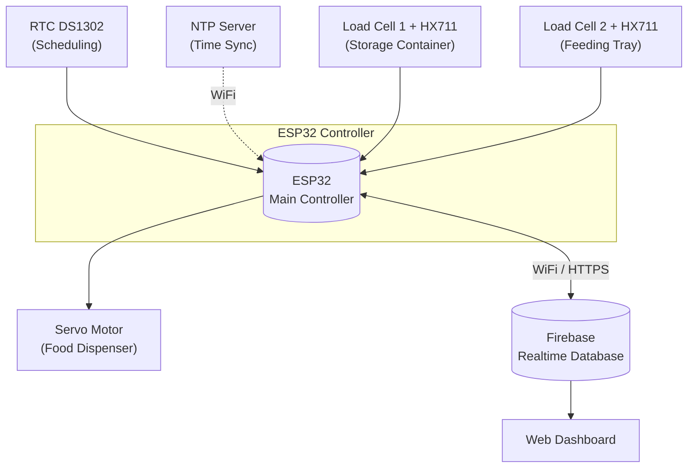
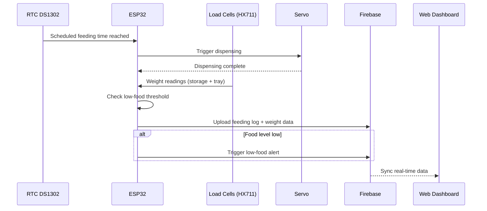

# Smart Pet Feeding System

An IoT-based automatic pet feeding system built on **ESP32**, featuring scheduled feeding, real-time food level monitoring via dual load cells, and cloud-based tracking through **Firebase Realtime Database**, with a companion web dashboard.

---

## Overview

This project automates pet feeding using a microcontroller-based system that:
- Dispenses food on a fixed schedule (RTC + NTP synchronized)
- Monitors food quantity in both the **storage container** and the **feeding tray** using load cells
- Sends low-food alerts and logs feeding history to the cloud
- Allows remote monitoring through a web dashboard connected to Firebase

**Tech stack:** ESP32 · Firebase Realtime Database · Load Cell + HX711 · Servo Motor · RTC DS1302 · NTP

---

## System Block Diagram



**Components:**

| Component | Role |
|---|---|
| ESP32 | Central controller — reads sensors, controls servo, syncs with cloud |
| Load Cell + HX711 (x2) | Measures food weight in storage container and feeding tray |
| RTC DS1302 | Keeps real-time clock for scheduled feeding, backed up with NTP sync |
| Servo Motor | Opens/closes the food dispensing mechanism |
| Firebase Realtime Database | Stores feeding history, current food levels, and triggers alerts |
| Web Dashboard | Displays real-time status and feeding history to the user |

---

## Hardware Images


Sơ đồ đi dây toàn bộ hệ thống: ESP32, load cell + HX711, RTC DS1302, servo motor.

---

## Data Flow Description

1. **Scheduling** — RTC DS1302 giữ thời gian thực; ESP32 đồng bộ định kỳ qua NTP khi có WiFi để đảm bảo giờ giấc chính xác.
2. **Trigger** — Khi đến giờ ăn đã lên lịch (hoặc người dùng kích hoạt từ xa qua web dashboard), ESP32 ra lệnh cho servo motor mở cơ cấu phân phối thức ăn.
3. **Sensing** — Hai cảm biến load cell (qua module HX711) liên tục đo khối lượng:
   - Load cell tại **storage container** xác định lượng thức ăn còn lại trong kho.
   - Load cell tại **feeding tray** xác định lượng thức ăn thú cưng đã ăn / còn lại trong khay.
4. **Processing** — ESP32 xử lý dữ liệu cân nặng, tính toán lượng thức ăn đã cấp phát, và so sánh với ngưỡng cảnh báo (low-food threshold).
5. **Cloud Sync** — Dữ liệu (thời gian cho ăn, khối lượng thức ăn, trạng thái thiết bị) được gửi lên **Firebase Realtime Database** theo thời gian thực.
6. **Alerting & History** — Nếu lượng thức ăn trong storage thấp hơn ngưỡng, hệ thống ghi cảnh báo low-food lên Firebase. Mọi lần cho ăn đều được lưu lại thành feeding history để truy xuất sau này.
7. **Monitoring** — Người dùng theo dõi trạng thái hệ thống và lịch sử cho ăn theo thời gian thực thông qua web dashboard, được đồng bộ từ Firebase.



---

## Features

- Scheduled feeding via RTC + NTP sync
- Dual load cell monitoring (storage + tray)
- Cloud-based monitoring via Firebase Realtime Database
- Low-food alert mechanism
- Feeding history tracking
- Web dashboard for remote monitoring

## Hardware Used

- ESP32 Dev Board
- 2x Load Cell + HX711 Amplifier Module
- RTC DS1302
- Servo Motor
- Food storage + dispensing mechanism (3D printed / custom-built)

## Project Structure

```
pet_feeder_web/
├── README.md              # Tổng quan hệ thống 
├── .firebase/              # Cấu hình Firebase (deploy/hosting)
├── firmware/                # ESP32 firmware (PlatformIO) 
│   ├── src/
│   ├── include/
│   ├── lib/
│   ├── platformio.ini
│   └── README.md           
├── web/                     # Web dashboard
│   └── README.md           # Hướng dẫn chạy web
└── images/                  # Hình ảnh phần cứng
    └── hardware_overview.png
```

