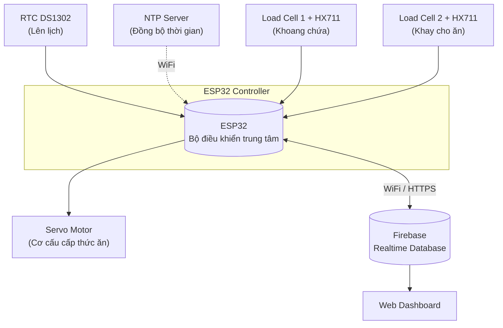
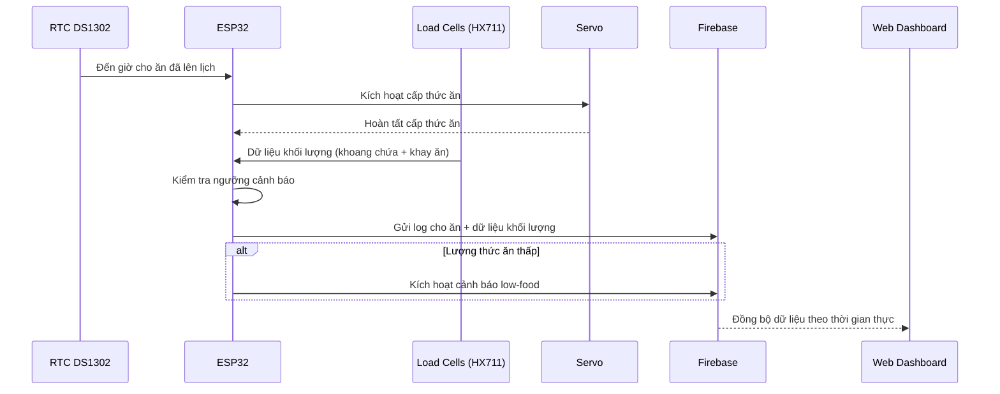

# Hệ Thống Cho Thú Cưng Ăn Thông Minh

**Tiếng Việt** | [English](./README.md)

Hệ thống cho thú cưng ăn tự động ứng dụng IoT, xây dựng trên nền **ESP32**, với khả năng cho ăn theo lịch, giám sát lượng thức ăn theo thời gian thực qua hai cảm biến load cell, và đồng bộ dữ liệu lên cloud thông qua **Firebase Realtime Database**, đi kèm web dashboard.

---

## Tổng Quan

Dự án này tự động hóa việc cho thú cưng ăn bằng một hệ thống dựa trên vi điều khiển có khả năng:
- Cấp thức ăn theo lịch cố định (đồng bộ RTC + NTP)
- Giám sát lượng thức ăn ở cả **khoang chứa (storage container)** và **khay cho ăn (feeding tray)** bằng load cell
- Gửi cảnh báo khi lượng thức ăn thấp và ghi lại lịch sử cho ăn lên cloud
- Cho phép giám sát từ xa thông qua web dashboard kết nối với Firebase

**Công nghệ sử dụng:** ESP32 · Firebase Realtime Database · Load Cell + HX711 · Servo Motor · RTC DS1302 · NTP

---

## Sơ Đồ Khối Hệ Thống



**Các thành phần:**

| Thành phần | Vai trò |
|---|---|
| ESP32 | Bộ điều khiển trung tâm — đọc cảm biến, điều khiển servo, đồng bộ cloud |
| Load Cell + HX711 (x2) | Đo khối lượng thức ăn ở khoang chứa và khay cho ăn |
| RTC DS1302 | Giữ thời gian thực cho lịch cho ăn, được sao lưu bằng đồng bộ NTP |
| Servo Motor | Đóng/mở cơ cấu cấp thức ăn |
| Firebase Realtime Database | Lưu lịch sử cho ăn, mức thức ăn hiện tại, và kích hoạt cảnh báo |
| Web Dashboard | Hiển thị trạng thái và lịch sử cho ăn theo thời gian thực cho người dùng |

---

## Hình Ảnh Phần Cứng

<p align="center">
  
</p>

Sơ đồ đi dây toàn bộ hệ thống: ESP32, load cell + HX711, RTC DS1302, servo motor.

---

## Sản Phẩm Hoàn Thiện

<p align="center">
  
</p>

---

## Web Dashboard

Giao diện web được xây dựng bằng Firebase Hosting, cung cấp khả năng giám sát theo thời gian thực, lịch sử cho ăn, cấu hình lịch, và công cụ tính khẩu phần ăn hàng ngày cho thú cưng.

### Giám Sát Theo Thời Gian Thực & Phát Hiện Bất Thường


Hiển thị lượng thức ăn còn lại trong khoang chứa, lượng thức ăn hiện có trên khay, và tóm tắt bữa ăn gần nhất (mục tiêu so với lượng thực tế đã xả). Dashboard sẽ cảnh báo khi phát hiện bất thường, ví dụ như chênh lệch giữa lượng thức ăn xả ra và lượng thức ăn tiêu thụ, có thể do cảm biến khay ăn cần hiệu chỉnh lại.

### Lịch Sử Bữa Ăn


Nhật ký theo thời gian của từng lần cho ăn, hiển thị lần cho ăn đó là theo lịch hay thủ công, khẩu phần mục tiêu, lượng đã xả, và lượng thực tế đã ăn.

### Lịch Cho Ăn & Điều Khiển Thủ Công


Cho phép người dùng cấu hình giờ ăn bữa sáng và bữa chiều, lưu lịch xuống thiết bị, và kích hoạt cho ăn thủ công ngay lập tức khi cần.

### Công Cụ Tính Khẩu Phần Ăn


Tính toán nhu cầu năng lượng hàng ngày của mèo (RER/MER) dựa trên cân nặng, mục tiêu cân nặng (ví dụ: duy trì cân nặng), và loại thức ăn, sau đó đề xuất khẩu phần ăn cho mỗi bữa. Khẩu phần tính được có thể áp dụng trực tiếp vào lịch cho ăn của thiết bị.

---

## Mô Tả Luồng Dữ Liệu

1. **Lên lịch** — RTC DS1302 giữ thời gian thực; ESP32 đồng bộ định kỳ qua NTP khi có WiFi để đảm bảo giờ giấc chính xác.
2. **Kích hoạt** — Khi đến giờ ăn đã lên lịch (hoặc người dùng kích hoạt từ xa qua web dashboard), ESP32 ra lệnh cho servo motor mở cơ cấu phân phối thức ăn.
3. **Đo lường** — Hai cảm biến load cell (qua module HX711) liên tục đo khối lượng:
   - Load cell tại **khoang chứa** xác định lượng thức ăn còn lại trong kho.
   - Load cell tại **khay cho ăn** xác định lượng thức ăn thú cưng đã ăn / còn lại trong khay.
4. **Xử lý** — ESP32 xử lý dữ liệu cân nặng, tính toán lượng thức ăn đã cấp phát, và so sánh với ngưỡng cảnh báo (low-food threshold).
5. **Đồng bộ Cloud** — Dữ liệu (thời gian cho ăn, khối lượng thức ăn, trạng thái thiết bị) được gửi lên **Firebase Realtime Database** theo thời gian thực.
6. **Cảnh báo & Lịch sử** — Nếu lượng thức ăn trong khoang chứa thấp hơn ngưỡng, hệ thống ghi cảnh báo low-food lên Firebase. Mọi lần cho ăn đều được lưu lại thành lịch sử để truy xuất sau này.
7. **Giám sát** — Người dùng theo dõi trạng thái hệ thống và lịch sử cho ăn theo thời gian thực thông qua web dashboard, được đồng bộ từ Firebase.



---

## Tính Năng

- Cho ăn theo lịch với đồng bộ RTC + NTP
- Giám sát lượng thức ăn bằng hai load cell (khoang chứa + khay ăn)
- Giám sát qua cloud bằng Firebase Realtime Database
- Cơ chế cảnh báo khi thức ăn sắp hết
- Lưu lịch sử cho ăn
- Web dashboard để giám sát từ xa
- Công cụ tính khẩu phần ăn cá nhân hóa

## Phần Cứng Sử Dụng

- ESP32 Dev Board
- 2x Load Cell + Module khuếch đại HX711
- RTC DS1302
- Servo Motor
- Khoang chứa và cơ cấu cấp thức ăn (in 3D / tự chế)

## Cấu Trúc Project

```
pet_feeder_web/
├── README.md              # Tổng quan hệ thống (Tiếng Anh)
├── README.vi.md            # Tổng quan hệ thống (file này, Tiếng Việt)
├── .firebase/               # Cấu hình Firebase (deploy/hosting)
├── firmware/                 # Firmware ESP32 (PlatformIO)
│   ├── src/                  # Mã nguồn các module
│   ├── include/
│   ├── lib/
│   ├── platformio.ini
│   └── README.md
├── web/                      # Web dashboard
│   └── public
│       └── 404.html
│       └── index.html
│       └── style.css
│   └── .firebaserc
│   └── .gitignore
│   └── firebase.json
└── images/                   # Hình ảnh phần cứng và screenshot web dashboard
    ├── hardware_overview.jpg
    ├── finished_product.jpg
    ├── web_interface1.jpg
    ├── web_interface2.jpg
    ├── web_interface3.jpg
    └── web_interface4.jpg
```


## Giấy Phép

MIT License (hoặc cập nhật theo lựa chọn của bạn)
